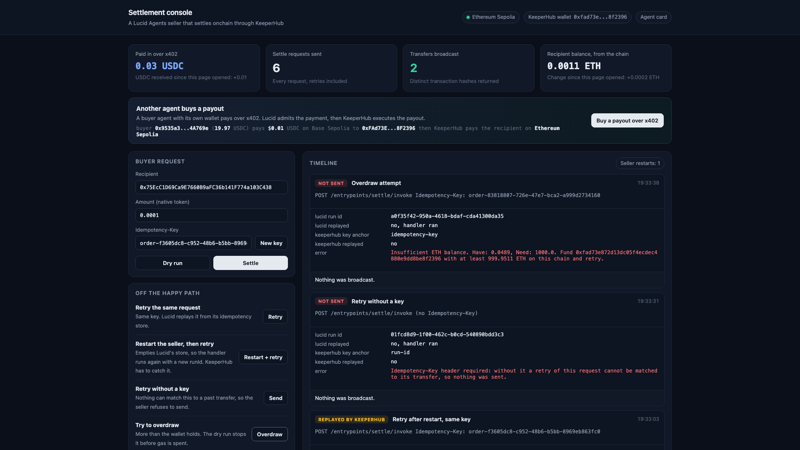
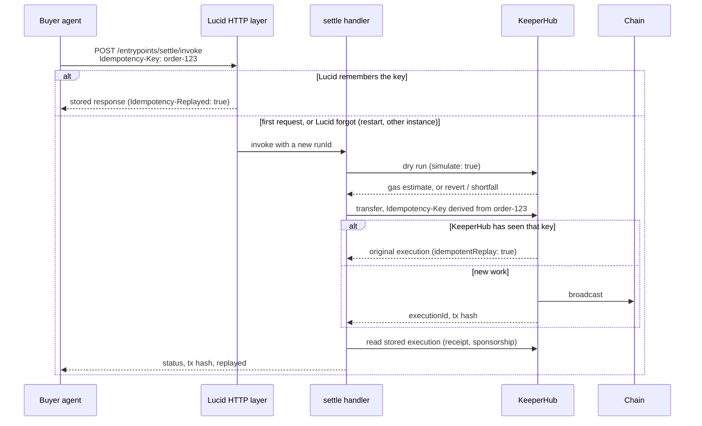

# lucid-keeperhub

**Deterministic onchain settlement for [Lucid Agents](https://github.com/daydreamsai/lucid-agents), executed through [KeeperHub](https://keeperhub.com).**

A Lucid extension that gives a selling agent somewhere safe to put the onchain
half of its work. Another agent pays over Lucid's x402 flow; KeeperHub executes
what was bought: dry-run preflight, broadcast, a verifiable transaction hash for
the buyer, and a guarantee that a retried request does not pay out twice, even
across a seller restart.

```ts
const runtime = await createAgent({ name: 'payout', version: '1.0.0' })
  .use(http())
  .use(keeperhub({ defaultChainId: 11155111, requireIdempotencyKey: true }))
  .addEntrypoint({
    key: 'settle',
    input: z.object({ recipient: z.string(), amount: z.string() }),
    metadata: { keeperhub: { settles: true } },
    handler: async (ctx) => {
      const outcome = await ctx.runtime.keeperhub.settle(
        { recipientAddress: ctx.input.recipient, amount: ctx.input.amount },
        { context: ctx },   // anchors KeeperHub's idempotency to the buyer's request
      );
      return { output: { tx: outcome.transactionLink } };
    },
  })
  .build();
```



Demo video: [docs/demo.mp4](docs/demo.mp4) (2.5 min, recorded against Ethereum Sepolia by `scripts/video/record.mjs`).

## Proof

Executed through KeeperHub on Ethereum Sepolia, gas sponsored by KeeperHub:

| Run | Transaction | What it shows |
| --- | --- | --- |
| `npm run demo` | [0x1fea0eda...8ee2](https://sepolia.etherscan.io/tx/0x1fea0eda66c0be15da490376f1b84c3ffa2831ce22127b68794a9cc478398ee2) | Dry run, settle, then an identical replay that returned this same transaction |
| Demo console | [0xc7a97c37...b196](https://sepolia.etherscan.io/tx/0xc7a97c370a484ff69003386bd5fec25941da074f1dcd0c59b70e01529a31b196) | Five settle requests (retry, seller restart then retry, no key, overdraw) and exactly one transfer |

## Why this exists

Lucid Agents is explicit about its boundary. It provides one runtime for
schemas, payment admission, policy, idempotency, fulfillment, discovery and
accounting, **while wallets, payment protocols, networks, and facilitators
remain external.**

That leaves a hole on the fulfillment side. An agent that *sells onchain work*
(a payout service, a rebalancer, a treasury bot) has nowhere to put the
execution, so in practice it does this inside the handler:

```ts
const wallet = new ethers.Wallet(process.env.PRIVATE_KEY!, provider);
const tx = await wallet.sendTransaction({ to: input.recipient, value });
```

Private key in process memory. No dry run, so a revert is discovered by paying
gas for it. No nonce management. No audit trail. And no idempotency, so a buyer
that retries a timed-out call is paid twice, which is the default behaviour of
the code above and exactly what an LLM-driven caller does.

This extension replaces that block with KeeperHub: non-custodial Turnkey
wallets, dry-run preflight, nonce management, retries, and a per-execution
audit trail, behind one typed runtime slice.

## How a request flows



## What makes it an integration rather than a wrapper

### 1. Two layers of idempotency, anchored to the buyer's key

The obvious anchor inside a Lucid handler is `runId`. It is the wrong one.
`@lucid-agents/http` mints a fresh `crypto.randomUUID()` for every HTTP
request, so a buyer that retries arrives with a new `runId`, and a settlement
keyed on it is new work to KeeperHub.

Lucid does replay retries that carry an `Idempotency-Key`, but from a
process-local store by default. A seller restart, a second instance behind a
load balancer, or an in-progress claim that outlives its TTL all run the handler
again, with a new `runId`.

So `settle({ context: ctx })` anchors the KeeperHub `Idempotency-Key` to the
buyer's `Idempotency-Key`, scoped by entrypoint and verified caller. Whatever
Lucid's HTTP layer forgets, KeeperHub's execution-level record still matches the
retry to the transfer that already happened. `src/__tests__/http-retry.test.ts`
proves it through the real Lucid HTTP stack: settle, restart the seller, retry;
the handler runs again with a new `runId` and KeeperHub still sends one
transfer. The control, anchored to `runId`, sends two.

`requireIdempotencyKey: true` refuses to settle a request that carries no key,
because nothing could make its retry safe.

### 2. Body canonicalization, which closes KeeperHub's 409 trap

KeeperHub hashes the request body to detect idempotency conflicts and
normalizes key order but not values, so a rebuilt body (`"0.1"` vs `"0.10"`, a
checksummed vs lowercase address, `1` vs `"1"`) conflicts with work already in
flight. Amounts are canonicalized with string arithmetic, never a float
round-trip, and the key is derived from that same canonical body, so key and
body cannot disagree.

### 3. Two-phase settlement, with proof recovered rather than assumed

The execute endpoints return a hash only when the step reported success. A
`failed` or `unconfirmed` response carries none, even when a transaction really
was broadcast. `settleTransfer` always reads the stored execution back, surfaces
`sponsored` (a sponsored transfer never touches the org EOA's nonce, so EOA
checks conclude nothing happened), and treats a verified reverted receipt as a
failure even though a hash exists.

### 4. A retry policy that cannot double-send

| Condition | Retried? | Why |
| --- | --- | --- |
| `429` rate limit | yes, honouring `Retry-After` | Rejected before execution. |
| `5xx` or dropped connection, with an idempotency key | yes | KeeperHub matches the retry to the original. |
| `5xx` or dropped connection, without a key | no | It may have executed, and nothing can match a retry. |
| Any failure carrying a `transactionHash` | no | A transaction is already live; a retry signs a second. |
| `idempotency_in_progress` | yes, same key | Rotating escapes the in-progress guard. |
| Revert, scope, spend cap | no | Repeating cannot change the outcome. |

Errors follow KeeperHub's mandated discriminator order (`code`, then
`failureKind`, then `wouldRevert`), and anything unattributable defaults to not
retryable.

### 5. Agent-to-agent commerce: x402 in, KeeperHub out

The example seller exposes a priced `payout` entrypoint. A buyer agent with its
own wallet calls it through Lucid's own `createX402Fetch`: Lucid answers with a
402 challenge ($0.01 USDC on Base Sepolia, payable to the seller's KeeperHub
wallet), the buyer signs, the facilitator settles, and only then does the
handler settle the payout through KeeperHub. Revenue lands in the same wallet
KeeperHub pays out from.

The extension is ordered `after: ['payments', 'mpp']`, so settlement cannot run
before admission whatever order the extensions are installed in.
`src/__tests__/payment-ordering.test.ts` proves it through the real
`@lucid-agents/payments` extension: an unpaid call and a rejected payment both
return without the handler running or KeeperHub being called.

### 6. Discovery

`onManifestBuild` adds the capability to the A2A agent card, so a buying agent
learns this seller settles deterministically before it invokes anything:

```json
{
  "uri": "https://docs.keeperhub.com/api/direct-execution",
  "params": {
    "settlingEntrypoints": ["settle"],
    "defaultChainId": "11155111",
    "auditTrail": true, "dryRun": true, "idempotent": true
  }
}
```

## Install

```bash
npm install github:Sanchay117/lucid-keeperhub
```

Not yet published to npm; installing from GitHub builds the package on install.

**Pin zod to `4.4.3`.** `@lucid-agents/core@5` depends on exactly that version as
a hard dependency, so any other 4.x resolves a second copy and every
`addEntrypoint` schema fails to typecheck with a `$ZodCheck` mismatch. Add
`"overrides": { "zod": "4.4.3" }` to `package.json`.

You need a KeeperHub organization API key from **Settings > Developer**.
Broadcasting needs the `mcp:write` scope; a dry run works with `mcp:read`.

## API

### `keeperhub(options)`

| Option | Default | Meaning |
| --- | --- | --- |
| `apiKey` | `$KEEPERHUB_API_KEY` | Organization API key. |
| `defaultChainId` | none | Chain used when a call omits one. |
| `requireIdempotencyKey` | `false` | Refuse to settle a request without an `Idempotency-Key`. |
| `advertise` | `true` | Publish the capability in the agent card. |
| `settlementDefaults` | none | `preflight`, `confirm`, `maxPolls`, `pollIntervalMs`. |
| `baseUrl` | `https://app.keeperhub.com` | Override for self-hosted. |
| `maxAttempts` / `timeoutMs` | `4` / `60000` | Retry and timeout budget. |

Ordered `after: ['payments', 'mpp']`: settlement is fulfillment, so it runs
after payment admission has decided the invocation is entitled to it.

### `runtime.keeperhub`

| Method | Purpose |
| --- | --- |
| `settle(request, { context: ctx })` | Preflight, broadcast, confirm, keyed to the buyer's request. |
| `simulate(request)` | Dry run. Never signs. Returns gas estimate and sending wallet. |
| `status(executionId)` | KeeperHub's stored execution, the authoritative record. |
| `spendCap()` | Daily native-value caps. |
| `settlingEntrypoints()` | Entrypoints that declared settlement. |
| `client` | The underlying `KeeperHubClient`. |

`settle` resolves rather than throwing for onchain failure: a reverted or
underfunded transfer is an outcome to report to the buyer. It throws only for
conditions per-request handling cannot fix (bad credentials, scope, missing
wallet). Outcomes include `workIdSource` (`idempotency-key`, `run-id` or
`explicit`) so a caller can see how safe a retry was.

Declaring `metadata: { keeperhub: { settles: true, chainId } }` on an entrypoint
is validated at build time: an entrypoint that settles but names no chain fails
the build instead of the first paid request.

## Run it

```bash
npm install && npm run build
cp .env.example .env    # KEEPERHUB_API_KEY, DEMO_RECIPIENT, KEEPERHUB_CHAIN_ID
```

**Terminal demo.** Reads the spend cap, dry-runs, settles, prints the explorer
link, then replays the identical call and asserts the same transaction comes
back.

```bash
npm run demo
```

**Agent and demo console.**

```bash
cd examples/settlement-agent && npm install
set -a && . ../../.env && set +a
node --experimental-strip-types src/index.ts
```

Open `http://localhost:8787/demo`. Every button calls the agent's real Lucid
entrypoints. To enable the x402 purchase, set `PAYMENTS_FACILITATOR_URL`,
`PAYMENTS_NETWORK`, `PAYMENTS_RECEIVABLE_ADDRESS` and a throwaway
`BUYER_PRIVATE_KEY` holding Base Sepolia USDC from faucet.circle.com (see
`.env.example`). Or call the entrypoints directly:

```bash
curl localhost:8787/.well-known/agent-card.json
curl -X POST localhost:8787/entrypoints/settle/invoke \
  -H 'Content-Type: application/json' \
  -H 'Idempotency-Key: order-0001-a1b2c3d4e5f6' \
  -d '{"input":{"recipient":"0x...","amount":"0.0001"}}'
```

## Develop

```bash
npm run type-check
npm test        # 88 tests
npm run build
```

Tests run against the real `@lucid-agents/core`, `@lucid-agents/http` and
`@lucid-agents/payments` runtimes, not stand-ins: extension ordering, slice
conflicts, entrypoint hooks, manifest composition, HTTP idempotency and x402
admission are all enforced by Lucid's own code. Only KeeperHub and the x402
facilitator are stubbed.

## Limitations

- **Transfers are the settled path.** `contractCall` is typed on the client,
  but `settle()` wraps native and ERC-20 transfers only.
- **EVM only.** KeeperHub's Solana path is not targeted.
- **Polling, not callbacks.** `settle` polls the status endpoint.
- **A paid retry after a seller restart can charge the buyer again.** KeeperHub
  still sends one payout, because the key is the buyer's `Idempotency-Key`, but
  the spent x402 authorization cannot be replayed, so the buyer's x402 client
  pays a fresh one. Lucid's x402 payment-identifier reconciliation is built to
  close this and is not wired up here.
- **Lucid reports a buyer's insufficient USDC as a 503** "verification
  temporarily unavailable". The console checks the buyer's balance first.
- **`runId` fallback is weak by design.** Without an `Idempotency-Key` the
  settlement is safe only against retries inside one invocation. Use
  `requireIdempotencyKey` where that is not enough.
- **KeeperHub replays for 24 hours.** A retry after that window is new work.
  `occurrenceMs` buckets keys for jobs recurring slower than a day.
- **Scientific-notation amounts are not canonicalized.** Send plain decimals.

## License

MIT
